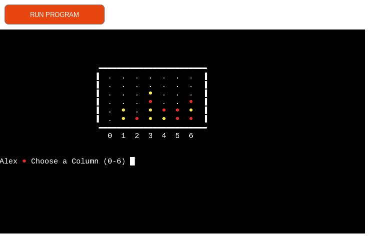
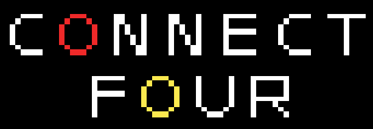
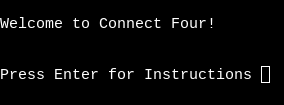
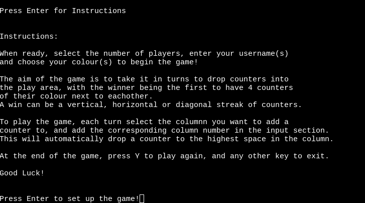
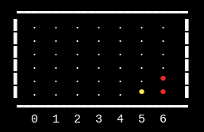
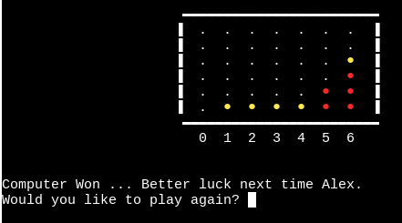

# Connect Four
This python terminal application is an arcade style version of the classic game Connect Four.

The game has a classic arcade feel to it, which fits well within the limits of a python terminal application. The application prints a board and counters to the terminal to illustrate the game, and is updated through user input. The game can be played as a two player game, with both players operating the same device, or as a one player game, with the user playing against the computer. The computer choice is mostly random, but the computer has some intelligence programmed in as it blocks streaks of 4 being played by the user and can detect when itself is about to win. The user(s) can select their usernames, and the game is replayable, giving the user a customised, complete experience. 

## Live Site 
[https://connect-four-python.herokuapp.com/](https://connect-four-python.herokuapp.com/)

 | 

## Repository 
[https://github.com/AlexSmall96/Connect-Four](https://github.com/AlexSmall96/Connect-Four)

## Author 
Alex Small
## Table of Contents

# UX
## Target Audience
The application is targeted towards anyone, with adults appreciating the retro arcade style, playful computer messages and the basic articifical intelligence involved.  Children can enjoy the ability to play a fully functioning game on a simple terminal environment.
 
## Project Goals
The goal of this project was to create a game that displayed enough complexity in the python code, that could also be visualised creatively and engagingly in the python terminal. Due to the rules of the game, the logic required to create fully functioning connect four application is quite complex at times, particularly with win detection. The project also aims to provide a user friendly experience, with easy to follow instructions, simple input methods and a customizable and replayable experience.

## User Stories
### Site User

As a site user I want to:

- See a visually appealing title that fits the theme of the game
- Recieve clear instrucrtions on how to setup and play the game
- Customise elements of the game such as username
- Recieve clear feedback on the outcome of the game
- Have the ability to replay the game

### Website Owner

As a site owner I want to:

- Express my design ideas freely and creatively
- Add my unique ideas to a game such as customisable usernames
- Write complex logic to ensure the game is fully functional in all play modes
- Showcase my skills and advertise my portfolio

## Features

The features of the site are given below, along with an image and its value to the user.

Feature                    |    Image                   |         Value to User
:-------------------------:|:-------------------------: | :-------------------------: 
Title                      | | An eye catching title to draw the users attention, stating clearly what game it is and giving the user an idea of the arcade style of the game  
Welcome Message             | | A welcoming message, setting up the playful theme of the game. Gives the user the ability to choose when the instructions are loaded by pressing enter.      
Instructions            | | Details the instructions clearly, both the rules of the game and how to input information. Gives the user the ability to choose when to load the next screen by pressing enter.
No. of players selection          | | Allows the user to choose wether to play against the computer or another player using the same device. This allows the user to always be able to play even if they are alone.
Username selection         | | Allows the user(s) to choose their username(s), which personalises the game and makes the feedback messages more engaging.
Game area         | | Bright colours allow the user to clearly see their counters on the board, the baord itself is well structured making the game feel more realistic and giving the players clear feedback on their progress.
Column input        | | Provides the user with a simple and intuitive way of inputting their column choice to add a counter to the game board
Win detection       | | Gives the user the complete experience of playing a fully functioning connect four game, with vertical, horizontal and diagonal wins being detected.
Win feedback message | | Provides the user with a personalised well done message when they win the game, containing their username.
Replay option | | Allows the user to smoothly and efficiently replay the game, reselecting the game mode, usernames and colors. This creates a complete and enjoyable experience for the user.
Computer is thinking message | | Makes the game more engaging and fun, and gives the user the feeling of playing against an intelligent computer.
Computer win detection and prevention | | Allows the user to experience a fully functioning game even in single player mode, with the computer making intelligent decisions.
Commiserations message | | Further personalises the game, completing the experience with a message containing their username
Goodbye message | | Completes the exerience with a simple goodbye message, thanking the user for playing and allows them to visit the developers github profile to explore more projects.

## Future Features

- More complex Artificial Intelligence algorithms could be implemented to make the computer perform better and therefore make single player mode more challenging. A common algorithm that is used in game theory is known as a [Minimax](https://en.wikipedia.org/wiki/Minimax) algorithm, which could be implemented in this case.

- Another feature that could be developed is the ability to play two player mode online with another player. 

- Further developments of this project may involve fixing the bug detailed in the Issues Found Section of [TESTING.MD](https://github.com/AlexSmall96/Connect-Four/blob/main/TESTING.md). When the 'Computer is thinking message...' is displayed, the user is still able to input a column choice, which affects their future inputs and results in multiple counters appearing on the board at once.

## Testing
Testing is detailed fully in [TESTING.MD](https://github.com/AlexSmall96/Connect-Four/blob/main/TESTING.md).

## Frameworks, Libraries & Programs Used

- gitpod
- github
- Python
- Heroku

### Python Libraries Used

- [os](https://docs.python.org/3/library/os.html) : This module provides a portable way of using operating system dependent functionality. It was used in this project to provide a simple way of clearing the terminal after each turn, so the game board can be reprinted. 

- [time](https://docs.python.org/3/library/time.html) : This module provides various time-related functions. The function time.sleep() was used in this project to allow the 'Computer is thinking...' to be displayed for 1.5 seconds, giving the impression of a computer deciding which column to select.

- [random](https://docs.python.org/3/library/random.html) : This module implements pseudo-random number generators for various distributions. It was used in this project in single player mode, when the computer hasn't detected any potential wins the column choice is random.

# Deployment
### Deploying the Site to Heroku

### Forking the Repository on GitHub
- On GitHub.com, navigate to the main page of the [Pairs](https://github.com/AlexSmall96/Pairs) repository.
- In the top-right corner of the page, click Fork.
- Select an owner for the forked repository.
- By default, forks are named the same as their upstream repositories. You can change the name of the fork to distinguish it further.
- Optionally, add a description of your fork.
- Choose whether to copy only the default branch or all branches to the new fork. For many forking scenarios, such as contributing to open-source projects, you only need to copy the default branch. By default, only the default branch is copied.
- Click Create fork.
### Cloning the Repository on GitHub
- On GitHub.com, navigate to the main page of the [Pairs](https://github.com/AlexSmall96/Pairs) repository.
- Above the list of files, click Code.
- Copy the URL for the repository.
- Open Terminal.
- Change the current working directory to the location where you want the cloned directory.
- Type git clone, and then paste the URL you copied earlier.
- Press Enter to create your local clone.

# Credits
## Content
The content of the site is all original thought, however the game itself is based on the classic game [Connect Four](https://en.wikipedia.org/wiki/Connect_Four)

## Code
The resources used for this project were the CI Python Essentials Module, along with some external resources:

- The code used to color the o's in the title was taken from the following article on [stackabuse](https://stackabuse.com/how-to-print-colored-text-in-python/).

- The symbols used to create the title, board and counters were inspired by [alt-codes.net](https://www.alt-codes.net).

- The code used to clear the last line of the terminal when 'Computer is thinking message ...' displays was taken from the following forum [stackoverflow](https://stackoverflow.com/questions/44565704/how-to-clear-only-last-one-line-in-python-output-console).

All external resources are commented in the code at the relevant places.

## Acknowledgements 
I would like to thank my mentor Harry Dhillon for his encouraging support and detailed feedback throughout this project.